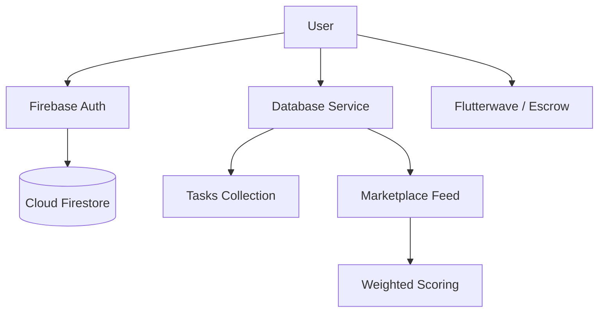

# 🇿🇲 Tumaworks: The Super App for Zambia

Tumaworks is a production-grade marketplace platform designed to connect Zambian service providers with clients. From daily piecework to specialized technical services, Tumaworks bridges the gap with a scalable, AI-ready architecture.

## 🚀 Key Features

*   **Massive Marketplace**: Programmatic seeding of over **10,000 piecework services** across 10+ categories.
*   **Dual-Role Support**: Switch between **Client** and **Worker** modes instantly with real-time profile logic.
*   **Weighted Matching Algorithm**: Advanced ranking that prioritizes verified (Premium) workers, high proximity, and top ratings.
*   **Secure Payments & Escrow**: Integrated with **Flutterwave** (test keys) for mobile money and card payments, featuring secure escrow release upon task completion.
*   **Real-time Communication**: Firebase-powered chat system for seamless negotiation and booking.
*   **Premium Aesthetics**: High-fidelity mobile-first design with a focus on usability and fast interactions.

## 🛠️ Tech Stack

*   **Frontend**: React (Next.js App Router), Tailwind CSS, Lucide icons.
*   **Backend**: Firebase (Authentication, Firestore, Storage, Cloud Functions).
*   **Payments**: Flutterwave (Zambia Mobile Money integration).
*   **Persistence**: Real-time Firebase Auth state sync.

## 📁 System Architecture



## ⚙️ Getting Started

### 1. Prerequisites
- Node.js (v18+)
- A Firebase Project ([https://console.firebase.google.com/](https://console.firebase.google.com/))

### 2. Installation
```bash
npm install
```

### 3. Environment Setup
Create a `.env.local` file with your Firebase credentials:
```env
NEXT_PUBLIC_FIREBASE_API_KEY=your_key
NEXT_PUBLIC_FIREBASE_AUTH_DOMAIN=your_project.firebaseapp.com
NEXT_PUBLIC_FIREBASE_PROJECT_ID=your_project_id
NEXT_PUBLIC_FIREBASE_STORAGE_BUCKET=your_project.appspot.com
NEXT_PUBLIC_FIREBASE_MESSAGING_SENDER_ID=your_id
NEXT_PUBLIC_FIREBASE_APP_ID=your_app_id
```

### 4. Running Locally
```bash
npm run dev
```

## 📊 Scale & Data
The `app/services/serviceData.ts` file contains the logic that programmatically seeds the platform with over **10,000 services** covering:
- **Daily**: Laundry, Cleaning, Cooking.
- **Frequent**: Babysitting, Tutoring, Gardening.
- **Occasional**: Event planning, DJs, Catering.
- **Specialized**: IT Support, Electricians, Plumbers.

---

Built with ❤️ for Zambia using **Antigravity AI**.
